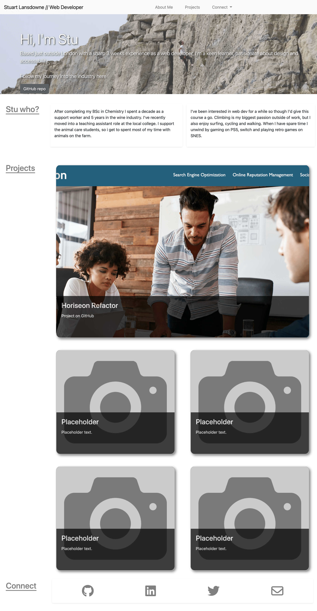

# bootstrap-portfolio

## Description 

This project aims to recreate my [personal portfolio](https://stuart540.github.io/personal-portfolio/) using bootstrap. Once the basic structure is achieved, the focus will be to improve upon the functionality and design to be closer aligned to my initial vision for the project.

As with the initial iteration of my portfolio, the hope is to showcase my front end web development skills as I progress from apprentice to web Ninja. As my knowledge increases there will be further iterations leading to a portfolio I hope will stand out, and help me on the next step in my development career.

Using the tools and assets in bootstrap I was able to recreate the initial project with some nice improvements to the design and functionality of the page. I have learnt a developer can save much time by utilizing bootstrap effectively, though this comes at the potential sacrifice of accessability and future modification.

The assets used from bootstrap include the nav bar, jumbotron and stretched button cards. After much trial and error I was able to have the cards display the full size with a shadow effect for the text.

## Link to deployed site

Please check out my deployed [bootstrap portfolio](https://stuart540.github.io/bootstrap-portfolio/)

## Usage 

This page is intended to simply be viewed at this stage, here is how it looks so far:

## Credits

Firstly, thanks to everyone at [bootstrap](https://getbootstrap.com/) for your beautiful assets and easy to use guides and instructions.

Thank you [FontAwesome](https://fontawesome.com/) for being awesome, and helping my page look a little more professional with your free icon assets.

And many thanks to [Code with Ania Kubów](https://www.youtube.com/watch?v=Xm4BObh4MhI&t=10521s) for helping to consolidate my CSS flex knowledge.

## License

This project is licensed under the standard MIT license
